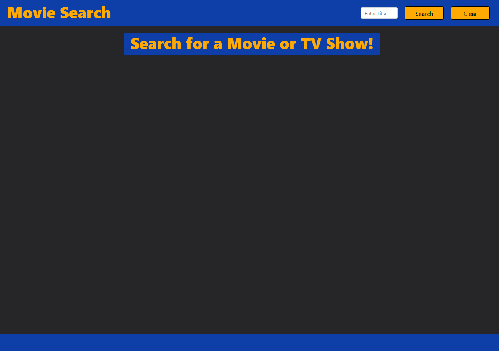
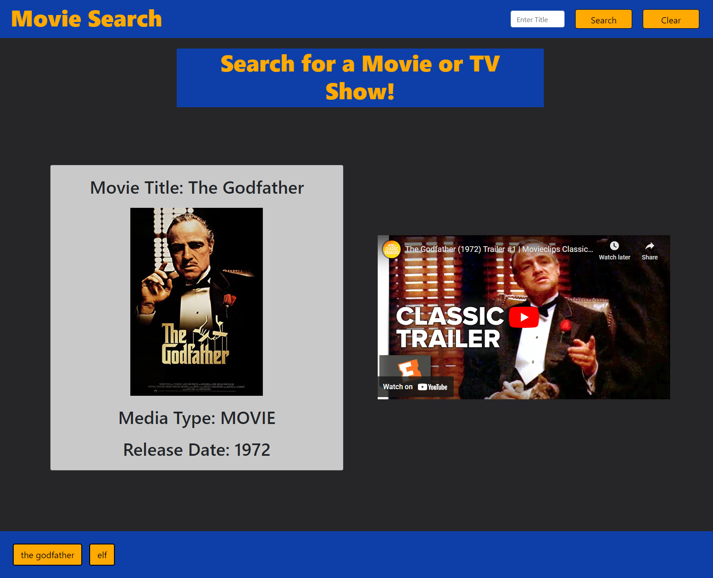
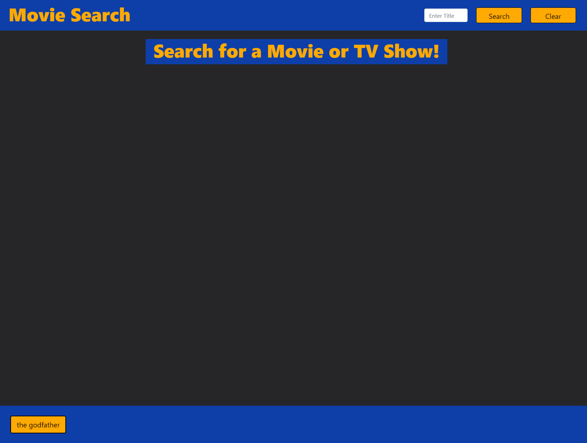
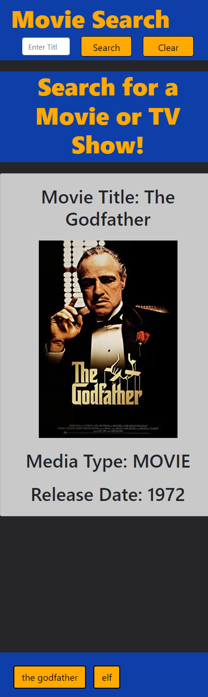

# Movie-Search-Project: BlockBuster 2.0

## Table of Contents
- [Description](#description)
- [Visuals](#visuals)
- [Authors](#authors)

## Description
This application has been created to give it's USERs the ability to search for movies, provide relevant facts about the films and associated trailers all in one place. Once the USER visits the webpage, they will be brought to screen with only the nav bar visible. A large search bar and button will appear at the top right of the page. The USER will simply enter their desired film's name in the bar and click the yellow search button. The page will then load and display that film's title, release date and official release poster. Once the page has fully loaded, a simple click on the poster will direct the USER to the movie's IMBd page which will allow access to trailers, cast information and more!

OMBd API and IMBd API were used in the programming for this application to function. 

## Visuals

## Authors
Carson Di Pangrazio
Christopher Bonime
Terrance Smith

## License
* MIT License

* Copyright (c) [2022]] [Carson Pangrazio, Terrance Smith, Christoher Bonime]

* Permission is hereby granted, free of charge, to any person obtaining a copy
of this software and associated documentation files (the "Software"), to deal
in the Software without restriction, including without limitation the rights
to use, copy, modify, merge, publish, distribute, sublicense, and/or sell
copies of the Software, and to permit persons to whom the Software is
furnished to do so, subject to the following conditions:

* The above copyright notice and this permission notice shall be included in all
copies or substantial portions of the Software.

* THE SOFTWARE IS PROVIDED "AS IS", WITHOUT WARRANTY OF ANY KIND, EXPRESS OR
IMPLIED, INCLUDING BUT NOT LIMITED TO THE WARRANTIES OF MERCHANTABILITY,
FITNESS FOR A PARTICULAR PURPOSE AND NONINFRINGEMENT. IN NO EVENT SHALL THE
AUTHORS OR COPYRIGHT HOLDERS BE LIABLE FOR ANY CLAIM, DAMAGES OR OTHER
LIABILITY, WHETHER IN AN ACTION OF CONTRACT, TORT OR OTHERWISE, ARISING FROM,
OUT OF OR IN CONNECTION WITH THE SOFTWARE OR THE USE OR OTHER DEALINGS IN THE
SOFTWARE.